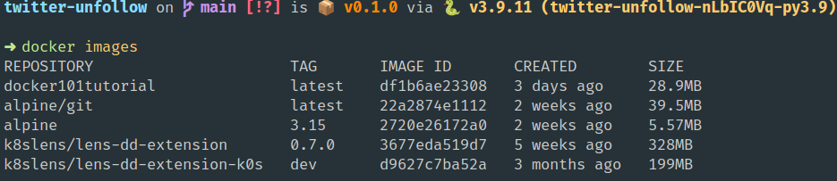

# Autoworkz - Automated Networking 

Automatically configure the networks. By the end of the project, you will understand the basics of software-defined networking.

1. How networking works.


## What we're doing?:

To further teach Python programming we'll dive into basic networking programming. We will do the following:

1. Writing an example mock docker container
   1. We manage the networking and resources for a mock docker container.
   2. Finished networking.
2. Declarative configuration
   1. Install pieces of software dynamically.
   2. Define a network
   3. Make changes to the network using automation.
3. Creating APIs for the network.
4. Creating command line tools to do exactly what's necessary.

## What I'm going to look for:

I will be looking for something during this project. I will primarily look for:

1. Understanding of operating systems and networking (from the mocker container project).
Code is written as proof of understanding.
3. Interact with different networking devices (using our project)

## Important Links

1. https://github.com/tonybaloney/mocker
2. https://github.com/pkgcore/pychroot
3. https://github.com/cloudsigma/cgroupspy
4. https://github.com/svinota/pyroute2


## **Assignments**


### **Assignment #1:** Duplicate functionality of the `images.py` File

Your job is to recreate the functionality of the `images.py` file (located [here](https://github.com/tonybaloney/mocker/blob/bffd33fb0abcce358ffea3e330ac43a6fd72c174/mocker/images.py)).

1. Understand what the file is doing.
   - What does [list_images](https://github.com/tonybaloney/mocker/blob/bffd33fb0abcce358ffea3e330ac43a6fd72c174/mocker/images.py#L15) do?
2. Convert the file manipulation within the file from `os` to `pathlib`.
   - What does it do?



#### How to Write Tables:

You can use the tool [rich](https://rich.readthedocs.io/en/latest/tables.html) to write modern tables for this assignment if you want. Its also possible to write tables from scratch. 

**Example code (from rich):**

```python
from rich.console import Console
from rich.table import Table

table = Table(title="Star Wars Movies")

table.add_column("Released", justify="right", style="cyan", no_wrap=True)
table.add_column("Title", style="magenta")
table.add_column("Box Office", justify="right", style="green")

table.add_row("Dec 20, 2019", "Star Wars: The Rise of Skywalker", "$952,110,690")
table.add_row("May 25, 2018", "Solo: A Star Wars Story", "$393,151,347")
table.add_row("Dec 15, 2017", "Star Wars Ep. V111: The Last Jedi", "$1,332,539,889")
table.add_row("Dec 16, 2016", "Rogue One: A Star Wars Story", "$1,332,439,889")

console = Console()
console.print(table)
```


## Frequently Asked Questions

Here are questions people may ask about coding in general.

### What is the difference between the `root` and `base` directory? 

Source material [here](https://stackoverflow.com/questions/33333711/what-is-difference-between-root-and-base-directory).


`root_dir` refers to base directory of output file, or working directory for your working script.

`base_dir` refers to the content you want pack.

For example, if you have a directory tree like:

```bash
/home/apast/git/someproject
```
And you want to build a package for `someproject` folder, you can set:

```bash
root_dir="/home/apast/git"
base_dir="someproject"
```

If the contents of your tree is like following, for example:

1. `/home/apast/git/someproject/test.py` vs.
2. `/home/apast/git/someproject/model.py`
